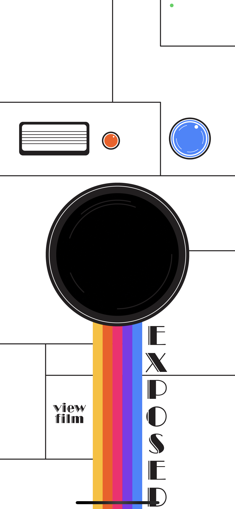

# Exposed

Exposed is a disposable camera themed iOS photo app created as aortion of my Arizona State University Barrett Honors Thesis. The app aims to serve as a disposable camera in the users pocket which encourgaes them to have a healtheir relationship with technology and photography. Much of the app including some of its features and art assets were inspired by Gen Z values and their relationship to technology.

